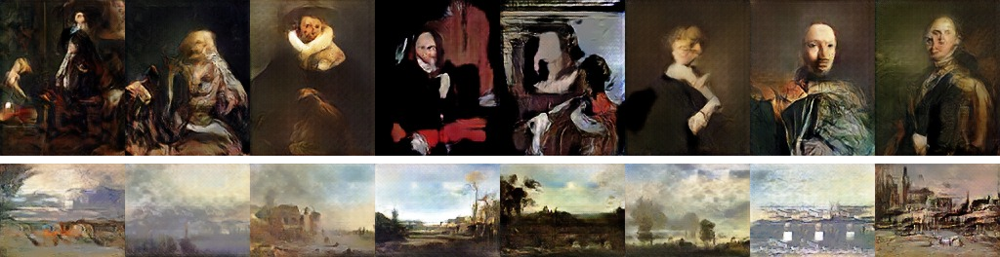
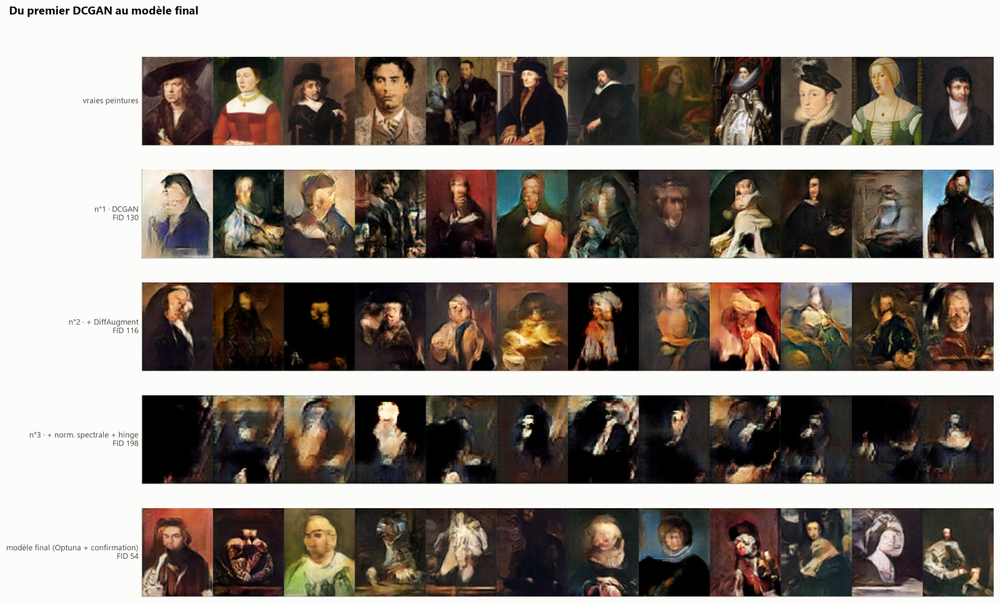
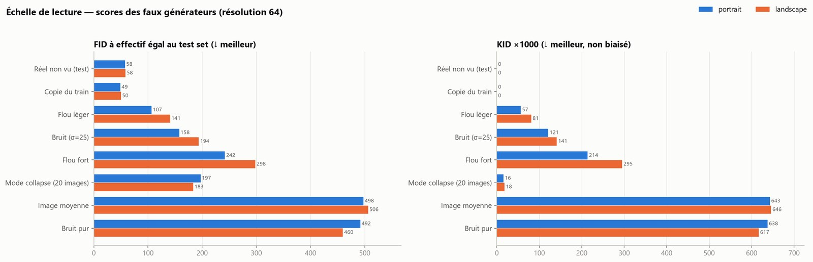
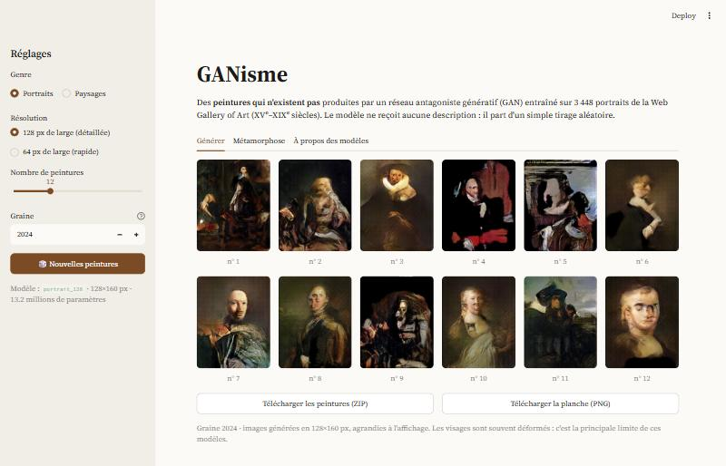

# GANisme — generating paintings with GANs

Generative adversarial networks trained from scratch to produce **paintings that do not exist**: portraits and
landscapes in the style of European painting from the 15th to the 19th century. No text prompt: the generator
starts from random noise only.



*Uncurated samples (fixed seed 2024) from the two 128-pixel models: portraits (128×160) and landscapes (128×96).*

School project (La Plateforme_, M2), carried out alone. The code is written in **English** (identifiers,
comments, docstrings, log messages); the explanations in the notebooks, the figure labels and the interface of the
application are in **French**. This README is the English entry point.

## Context

The brief: build an AI able to generate random painted artworks ("like DALL-E, but without the description"),
starting from a catalogue of 52,867 artworks of the [Web Gallery of Art](https://www.wga.hu). The project covers
the whole chain:

1. a literature review on GANs (15 questions);
2. an exploratory analysis of the catalogue;
3. scraping the 32,437 painting images;
4. building the training sets;
5. designing an evaluation protocol;
6. training and comparing models, then tuning hyperparameters;
7. a Streamlit application.

## Results

All scores are computed against the training set of the genre, on as many generated images as training images
(3,448 portraits, 2,714 landscapes), always from the same latent vectors.

| Model | Size | FID ↓ | Precision ↑ | Recall ↑ | Memorised copies |
|---|---|---|---|---|---|
| Portraits — baseline DCGAN | 64×80 | 130.0 | 0.37 | 0.07 | 0 % |
| Portraits — final | 64×80 | **54.5** | 0.62 | 0.28 | 0 % |
| Portraits — final | 128×160 | 71.1 | 0.66 | 0.10 | 0 % |
| Landscapes — baseline DCGAN | 64×48 | 79.8 | 0.83 | 0.03 | 0.1 % |
| Landscapes — final | 64×48 | **42.3** | 0.86 | 0.20 | 0.1 % |
| Landscapes — final | 128×96 | 61.9 | 0.87 | 0.07 | 0 % |

**How to read this table**

- **Scores are only comparable within one genre and one resolution.** Each has its own reference scale
  (notebook 03). When the 128-pixel images are downscaled and scored like the 64-pixel models, they are better:
  FID 41.1 instead of 54.5 for portraits, 37.7 instead of 42.3 for landscapes.
- **These FIDs are not comparable with published ones**, usually computed on 50,000 images: FID grows when fewer
  images are used.
- The 64×80 portrait setting was trained with three seeds: FID **56.5 ± 2.3** at the last epoch. Every other row is
  a single training run.
- **Precision** measures image quality, **recall** measures diversity. Recall stays far below that of real
  paintings (about 0.78): diversity is the main weakness.



*Top row: real paintings. Below: the same latent vectors given to each portrait model, from the first DCGAN to the
final 64×80 model.*

## Method in brief

- **Data.** 32,438 paintings in the catalogue; filters remove architecture photos, monochrome images, details of
  the same artwork (18 % near-duplicates), studio backgrounds and extreme formats. 24,860 paintings remain.
- **One model per genre, in the natural format of the genre** (4:5 portraits, 4:3 landscapes) instead of a square
  crop: the median area lost by cropping drops from 25 % to 5–7 %.
- **Evaluation.** FID, KID, precision/recall, density/coverage and a memorisation test, all in the Inception-v3
  feature space. Each metric was first tested on "fake generators" with a known defect (blur, noise, mode
  collapse, copy of the training set) to build a reference scale. This showed, for instance, that the Inception
  Score is useless on paintings and that KID barely detects mode collapse.
- **Models.** A DCGAN baseline, then one idea at a time: DiffAugment, spectral normalisation with hinge loss.
  The three models fail in three different ways (discriminator too strong, unstable, too weak): the problem is
  the balance between the two networks.
- **Hyperparameters.** A 30-trial Optuna study, then a confirmation run of the two best settings over 600 epochs
  and three seeds. FID goes from 116 to 56.5 without touching the architecture.
- **Scaling up.** The same hyperparameters transfer to 128 pixels and to a second genre (landscapes) without
  further tuning.



*Scores of the "fake generators" used as a reference scale (portraits and landscapes, 64 px).*

## The application

**Try it online: https://ganisme-romu.streamlit.app**



To run it locally:

```bash
pip install -r requirements.txt
streamlit run app.py
```

It runs without a GPU. Choose a genre and a resolution, draw new paintings, replay a seed, morph one painting into
another, and download the results. The four generators are in `models/`.

The online version is hosted on [Streamlit Community Cloud](https://streamlit.io/cloud), straight from this
repository: entry point `app.py`, and the root `requirements.txt`, which only lists what the application needs
(PyTorch for CPU).

## Repository layout

| Path | Purpose |
|---|---|
| `app.py` | Streamlit application |
| `models/` | the four exported generators (`.pt`) and their description (`models.json`) |
| `notebooks/01_eda_art_catalog.ipynb` | exploratory analysis of the catalogue |
| `notebooks/02_image_visualization.ipynb` | looking at the images, consequences for preprocessing |
| `notebooks/03_datasets_and_metrics.ipynb` | training sets, metrics, reference scale |
| `notebooks/04` to `06` | the three first models (DCGAN, + DiffAugment, + spectral normalisation) |
| `notebooks/07_optuna_portraits_64.ipynb` | hyperparameter study |
| `notebooks/08_confirmation_final_model_portraits_64.ipynb` | confirmation on three seeds, final 64×80 model |
| `notebooks/09_portraits_128.ipynb` | moving to 128×160 |
| `notebooks/10_landscapes.ipynb` | second genre: landscapes |
| `src/scrape_images.py` | resumable image download |
| `src/dataset.py` | filters, cropping, train/test split |
| `src/metrics.py` | evaluation metrics |
| `src/models.py` | generator and discriminator |
| `src/diffaugment.py` | differentiable augmentation |
| `src/train.py` | training loop, periodic evaluation, checkpoints, resume |
| `src/optuna_search.py` | hyperparameter study |
| `src/confirm_best.py`, `src/run_portrait_128.py`, `src/run_landscape.py` | resumable training queues |
| `src/generate.py`, `src/export_models.py` | image generation, export of the generators |
| `runs/` | configuration, training curves and scores of every run (checkpoints are not versioned) |
| `reports/metrics/`, `reports/optuna/` | result tables |
| `docs/reponse-question.md` | literature review (in French) |
| `docs/conclusion.md` | conclusion: results, difficulties, limits, next steps (in French) |
| `data/` | not versioned, see [`data/README.md`](data/README.md) |

## Reproducing the work

Requirements: Python 3.12, [uv](https://docs.astral.sh/uv/), a CUDA GPU (developed on an RTX 5060, 8 GB).
`requirements-train.txt` pins PyTorch built for CUDA 12.8; change the index URL for another setup. The
`--index-strategy` option lets uv take the other packages from PyPI.

```bash
uv venv
uv pip install --index-strategy unsafe-best-match -r requirements-train.txt
```

Then, with the environment activated and the data rebuilt as explained in [`data/README.md`](data/README.md):

```bash
python src/dataset.py                 # training sets
python src/train.py --help            # one training run
python src/optuna_search.py           # hyperparameter study (about 7.5 hours)
python src/confirm_best.py            # confirmation on three seeds (about 4 hours)
python src/run_portrait_128.py        # portraits in 128×160 (about 4 hours)
python src/run_landscape.py           # landscapes (about 2 hours)
python src/export_models.py           # export the generators to models/
```

A training run takes about 40 minutes at 64 pixels and up to 2.5 hours at 128 pixels. Long runs can be
interrupted and resumed: the same command picks up where it stopped.

Training is not bit-for-bit reproducible (GPU non-determinism), and the training loop was changed after the three
first models: re-running them would not give exactly the same numbers.

## Limitations

- **Faces are often distorted**, especially at 64 pixels.
- **Diversity is limited**: recall is far below that of real paintings.
- **The corpus is biased**: European painting from the 15th to the 19th century, dominated by the Italian, French,
  Dutch and Flemish schools. Generated images inherit this bias.
- **Few repetitions**: except for the 64×80 portrait setting, each model was trained once.
- **Training had not fully converged** at 600 epochs for several models.
- No hyperparameter search was run specifically for 128 pixels or for landscapes.

## Credits

- Images and catalogue: [Web Gallery of Art](https://www.wga.hu). The images are used for this educational project
  and are not redistributed here.
- Main references: Goodfellow et al. 2014 (GAN), Radford et al. 2015 (DCGAN), Heusel et al. 2017 (FID),
  Miyato et al. 2018 (spectral normalisation), Kynkäänniemi et al. 2019 (precision and recall),
  Zhao et al. 2020 (DiffAugment), Akiba et al. 2019 (Optuna).

Author: Romuald Courtois.
